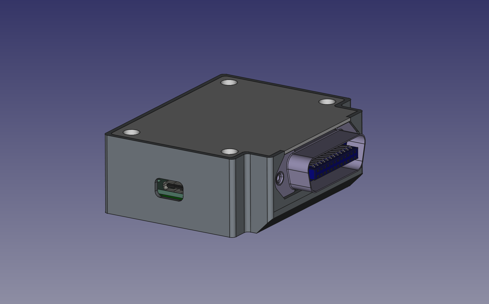
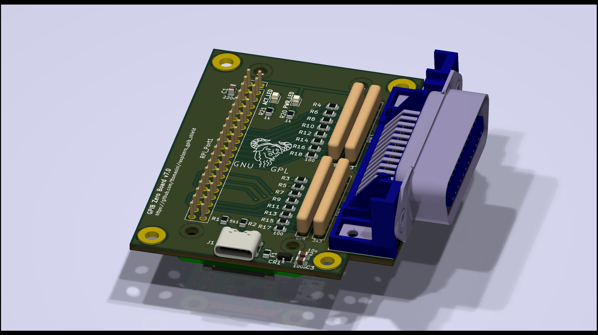
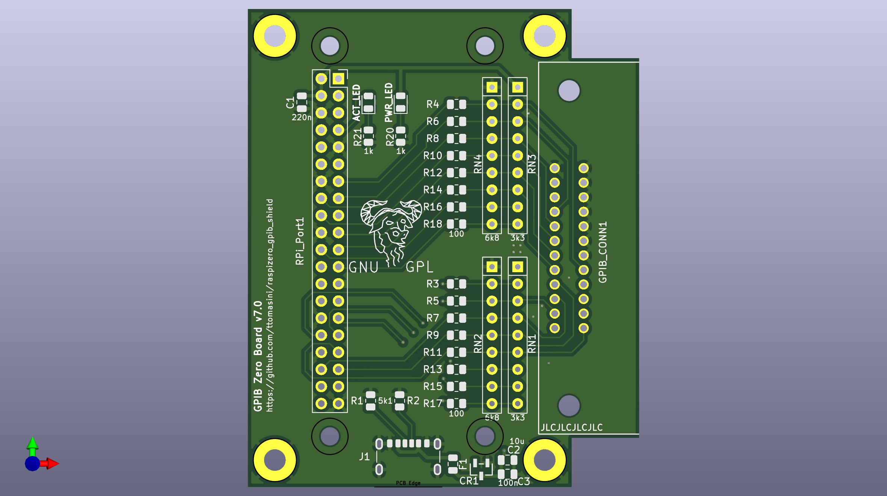

# raspizero_gpib_shield
A GPIB shield for the raspberry pi zero

Connecting GPIB-capable lab equipment to your PC nowadays is mostly a choice between several USB-to-GPIB adapters. If your platform of choice is linux, especially the Raspberry Pi, then you may run into trouble getting some of the proprietary adapters up and running.

The Raspberry Pi shield was created to solve this problem.

You can find the schematics for the raspberry-pi-zero GPIB shield here: [Link to schematics](Documentation/RaspiZero_GPIB_v7_schematic.pdf)

This shield is meant to be used with the [`gpib_bitbang`](https://linux-gpib.sourceforge.io/doc_html/supported-hardware.html#GPIO) driver from `linux-gpib`.

For preassembled v6 units please contact Elektronomikon (Thomas Klima) at elektronomikon@gmail.com and find further information at https://elektronomikon.org
